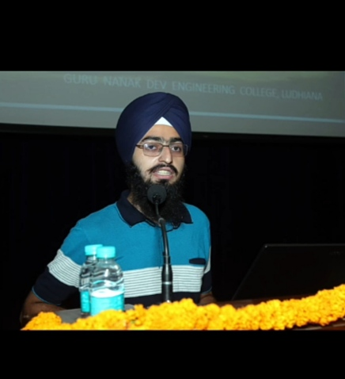
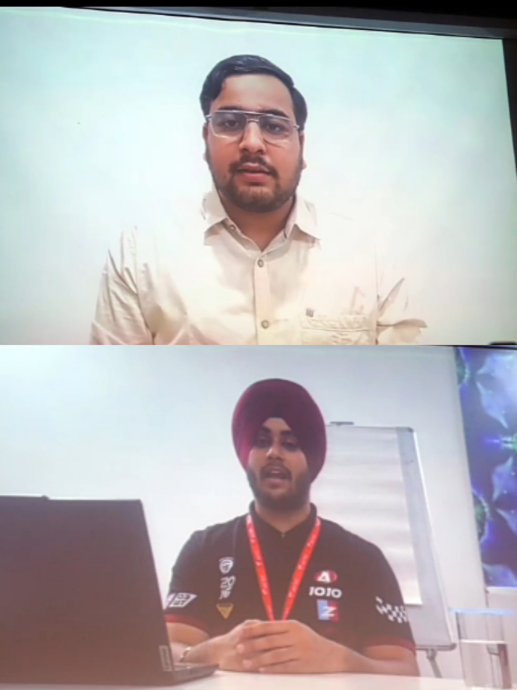

# **Profile :- Harsimran Kaur**
 

**PERSONAL INFORMATION** 

* **NAME** :- HARSIMRAN KAUR

*  **AGE** :- 18

*   **EDUCATION** :- B.TECH IN INFORMATION TECHNOLOGY (IT)

*   **EMAIL ID** :-simranhk.11@gmail.com
   
# **Report of Induction Program 2025**
# DAY :1 (31-July-2025)

8:30 to 9:30 *(Shabad Kirtan at Gurudawar Sahib)*

9:30 to 10:30 *(Tea and Snacks)*

10:30 *(Inaugural Ceremony AT Auditorium)*

*My first day at GNDEC started with all the CSE and IT students in the Gurdawara Sahib. Listening to the Shabad Kiratan **(ਸਤਿਗੁਰੁ ਹੋਇ ਦਇਆਲੁ ਤ ਸਰਧਾ ਪੂਰੀਏ।।
ਸਤਿਗੁਰੁ ਹੋਇ ਦਇਆਲੁ ਨ ਕਬਹੂੰ ਝੂਰੀਐ।।)** ,I Felt a deep sense of conection and spirituality. Listening to the guru's teachings inspired me to Cultivate values like compassion ,huminaty and self displine.* 

*The refreshments were a lovely way to cap off our visit to the gurdawara sahib.*
 
*After Refreshments we went to college Auditorium. In Auditorium the Atmosphere was Calm and the Stage was beautiful Decorated. We were Warmely Welcomed by **Host Miss. Taranpreet Kaur and Miss. Kusum**, who made sure we felt comfortable and valued. Then he invited Mr. Harsimarn singh on stage.*

* **Orator 1 Mr. Harsimran Singh Jaggi** :  **(ਤੁਸੀਂ GNE ਦੇ ਵਿਹੜੇ ਵਿੱਚ ਆਏ ਅਸੀਂ ਫੁੱਲੇ ਨਾ ਸਮਾਏ ,GNE ਦੇ ਵਿਹੜੇ ਵਿੱਚ ਤਸ਼ਰੀਫ਼ ਲਿਆ ਨੂੰ ਸਾਡੇ ਸਾਰਿਆਂ ਵਲੋਂ ਜੀ ਆਇਆਂ ਨੂੰ ,ਜੀ ਆਇਆਂ ਨੂੰ।)** *That lines make us very Happy. Mr. Harsimran Singh Greeted us and provided a comprehensive introdution about the college.*
 
# **Stars of GNDEC** 

* **Mr. Sangam Arora**
* **Mr. Arshpreet Singh**

_Mr. Sagam Arora , a proud **CSE** topper and currently placed at **Arguesoft**, shared his journey._

_Mr. Arshpreet Singh , the **IT** branch Topper now working at **Airtel** , Gurugram ,spoke about his learning and the role of GNDEC played in shapping his future._

**They both inspired us through a motivational video. They encouraged us to pursue our Passions and overcome challenges.**
 
* **Orator 2 MRs. Harpreet Kaur Garewal** (HOD of Applied Science) : *Her lecture made us feel like we were already a part of the GNDEC family. She delivered a deeply insightful and welcoming message , encouraging students to seize every opportunity with passion and discipline.*

* **Orator 3 Dr.Akshay Giddar** (Dean Academics) : *He interacted with the students and guided them on academic planning and institutional culture.* 

* **Orator 4 Harleen Kaur Garewal** (first year student) : *She Shared her thoughs and inspired her peers with her heartfelt speech.*

* **Orator 5 Dr. Parminder Singh** : *His Charismatic presence and motivational address left the entire auditorium charged with positivity and purpose.*

* **Orator 6 Dr. Sehajpal Singh** (principal of GNDEC) : *His visionary words and encouragement added great value to the day.*

# **Guest of Honour**

* **Shri Ravindra Garg** (Muncipal Corporation, Ludhiana)
* **En. Rakesh Kumar** (Alumnus of the 1991 Batch) 

*Their impactful words added immense grace and relevance of the occasion.*

* **Oreator 7 Shri Ashok Singla**(Financial Advisor) : *His Encouraging words gave students a new lens through which to view their future.*
* 
**2:00 to 4:00 pm** *(classes)*
  
*After the motivational lectures in the auditorium ,we proceeded to our designated classrooms.*

# **It was a day that reminded us of the importance of believing in ourselves and working towards our goals with determination and passion.**

# **DAY :2 (1-Aug-2025)**

 **9:30 to 10:30Am** *(English Proficiency Test)*

 **10:30 to 11:30** *(Math Proficiency Test)*

 **11:30 to 1:00Pm** *(Break)*

 **1:00 to 2:00Pm** *(AT Auditorium)*

  _Our host **Harleen Kaur** welcomed us and then invite our first orator_

* **Orator 1 : Satya schlorship team**

* **Manoj Kumar**
* **Manish Kumar**
* **Shivam Kumar**

* **Manoj Kumar** :*Mr. Manoj is the one delivering the lecture on satya scholarship program .The satya scholarship program is a merit-cum-means scholarship offered by the Nehru Sidhant Kender trust to support meritorious students from Ludhiana district in pursuing higher education.He shared inforation about satya scholarship like Eligibility,benefits etc.*

* **Manish Kumar** : *He informed us to how to fill satya scholarship application form. He gave us the chance to explore this valueable opportunity.*

 **2:00 to 3:00pm**
 
* **Orator 2** *(Expert Lecture by  Mr. Arshpreet Singh on Food)* : *He explain the advantages of healthy food. Healthy food does not cause disease , it actually reduce risk of disease in our body.
  The lecture really captured my attention and was very informative.*

  **3:00 to 3:30 Pm**
  
* **Orator 3** *(Session by Causmic Club and Launch of Induction Activities)* : *our senior took the initiative to educate us about the causmic club and offered valuable guidance as we participated in the induction activity. This lecture was really awesome.*

 # **DAY: 3 (2-Aug-2025)**

**8:30** (At college Auditorium)

_Our host **Taranpreet Kaur** welcome us very sweetly and then she invite our chief on stage._

* **Orator 1**

 **Chief Guest Sr. Gurcharan Singh garewal**( member of shiromani parbandak committiee) : *His motivational words encourged us to stay grounded in values while aspiring for excellence in their academic journey.*

* **Orator 2 Dr. jaswinder Singh** : *He captivated the students with live experiments and innovative apporaches to teaching and learning. His interative method of presentation brought an engaging and joyful learning experience for us,leaving a lasting impression.*

* **Orator 3 DR. Priyadarshini**(Expert in universl human value) :*She spoke about the critical role of ethics and values in the field of engineering, education, and professional pratice. Her session help us understand the importance of empathy, responsibility, and integrity in shapping a meaningful career and life.*

# **DAY :4 (4-Aug-2025)**

**9:30 to 10:30** (English Lecture)

* **Prof. Aastik Sharma**: *His teaching style id unique,helping students gain a profound understanding of literary texts and their contexts.*

**10:30 to 11:30**(Chemistry Lecture)

* **Prof. Karan Bhalla**: *He is a true mentor, guiding students towards achieving their academic and professional goals with dedication and expertise.*

**11:30 to 12:30**(Break)

**12:30 to 3:30**(At Auditorium)

_Our host *Kusum* welcome us and invite Dr. Priyadarshini mam on stage._

* **Orator 1 Dr. Priyadarshini** : *The lecture might have emphasized the significance of incorporeating universal humnan values into daily life, fostering sense of responsibility, and promoting harmony within oneself and with others.*
  
* **Orator 2 Session by causmic club** : *The causmic club team also showcased their vibrant initiatives, giving freshers a glimpse into creativity, leadership, and innovation.*

# **DAY :5 (5-Aug-2025)**

**9:30 to 10:30**(P2P Lecture) : *The P2P Lecture on c++ by our seniors was incredibly helpful, they have a talent for explaning complex conceots simply.*

**10:30 to 11:30**(BEEE Lecture by prof.Simranjeet Kaur) : *The way she taugth us BEEE was fantastic, her method was engaging and impressive approach.*

**11:30 to 12:30**(physics lecturte) :*She provided a comprehensive overview of the physics lab and workshops, offering valueable insights and practical knowledge that greatly enhanced our understanding of subject.*

# **DAY :6 (6-Aug-2025)**

 

